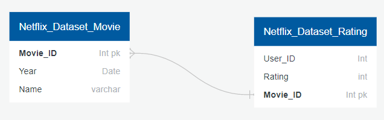

# MOVIE RECOMENDATION SYSTEM USING MACHINE LEARNING BASED ON PREVIOUS REVIEWS FROM OTHER USERS (NETFLIX)

## Project Overview
We found a big opportunity in movie streaming channels. Our finfdings showed us that users can spend between 20 - 40 minutes browsing movie catalogues while trying to decide which movie they'd like to watch. Our project cosist on delveloping a solution to reduce that time span to a minimun while offering the best recomendations based on information the user provides, while the system analyses previous reviews from other users in a data base and deliver an accurate recommendation to our users. 

Our business proposal aims to be replicated to search into any streaming catalogue. The objective is to close deals with all the available commercial streaming companies, in order to be an user charge-free platorm, making it quite attractive to the final consumer. 

## Data-source description
- The datasources are an extractions from Netflix catalogue broken down into two sets. 
- The first set consists in the hard characteristics from the movie catalogue, Movie_ID, Year; Name. This data set is named Netflix_Dataset_Movie.CSV
- The second dataset contains the rating information from the the same movie catalogue and it consists in User_ID, Rating, Movie_ID. This data set is named Netflix_Dataset_Ratings.csv

>Both data sets can be joined into a single dataframe to be analyzed using the Movie_ID dimenssion. 

## Problems we are trying to solve
Asking the right questions... Can this system recommend me a movie I'd like based on my likings? 

Yes the system can solve this questions and many more. The objective is to help our consumers to spend less time looking for movies and more time having fun watching them. Now the real question would be cheddar or caramel pop-corn?

# Team Comms Protocols
The team keeps updated on a regular basis making the most of the tools we learned to use in during the course. 
- Slack / A custom teamgroup where we keep constant updates on any new findings, ideas, share files and jokes. 
- Zoom Meetings / Group sessions to keep us aligned during the thinking process. 

# Outline of the project

I. Description of the project
  
  
II. Database

    - Movie Datasets. Description of the columns
    - Cleaning Data
    - Data Exploration
 
III. Machine Learning Model

    - Building Model
    - ALS Algorithm
    
IV. Dashboard
    - Hierarchy
    - Toolkit: Javascript, CSS, HTML, Bootstrap
